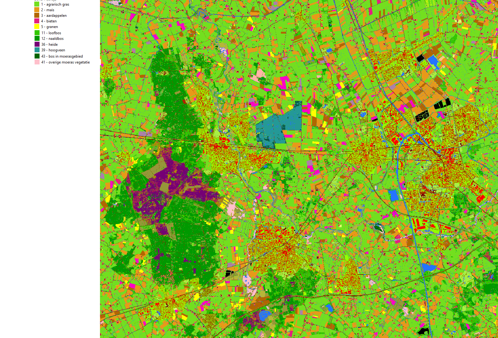
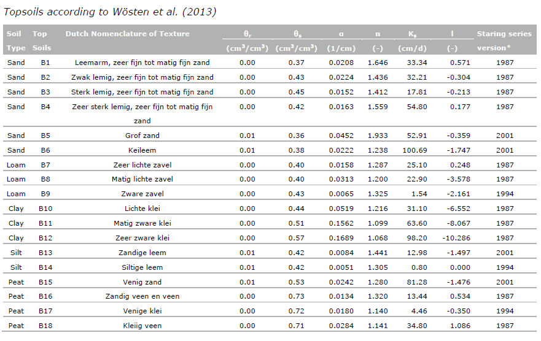
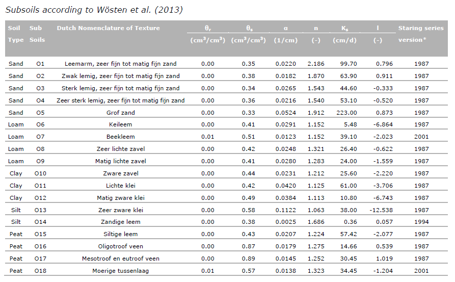
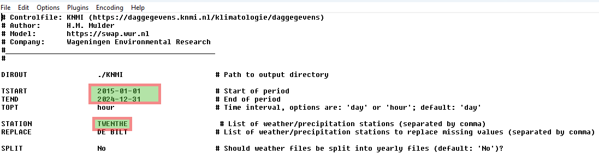
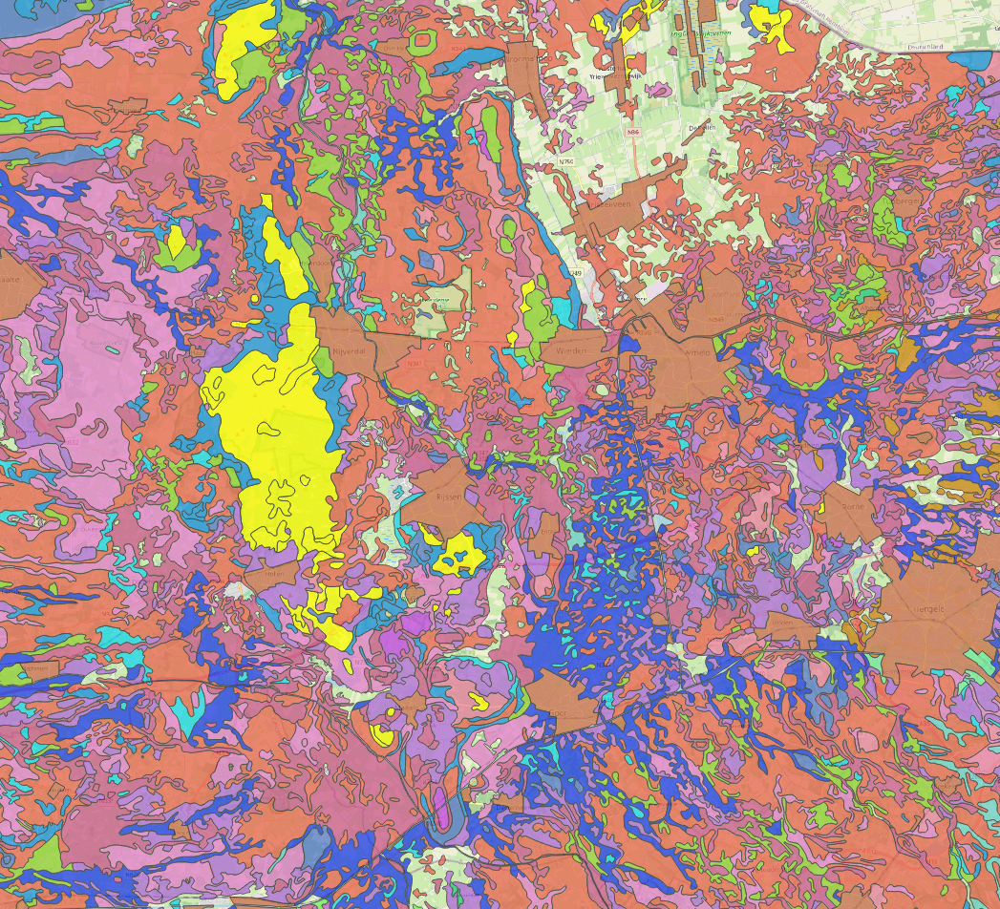
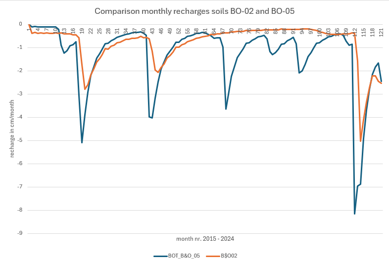
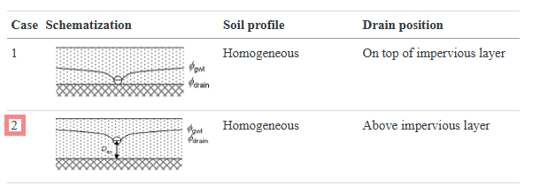

# SWAP simulations

For creating recharge time series for the transient Wierden model, up till now, R scripts were used.

These scripts coupled 3 unsaturated zone models to a script simulating saturated conditions (two layers).

Vegetational aspect ares trivialized and simulations took a long time

SWAP could be used instead to create somewhat more realistic recharge time series, which are based on:

- Actual meteorological data from KNMI

- Using Pennmann Monteith/Makking for Evapotranspiration

  - using crop/vegetation specs.

- Soils located at different locations, and with different vegetation types

  - Deep groundwater tables with trees (Holterberg)

    - Free drainage $\frac{\partial \psi}{\partial z}\approx0$ as lower boundary condition

    - Initial pressure distributions around -100 -200 cm; at around field capacity

  - Shallow groundwater tables with grass and maize

    - Drainage as lower boundary condition

    - Initial pressure distribution around -100 -200 cm (pF 2 - 2.3); so at around field capacity

The following sections describe the various setting which are used for the Wierden case.

Many more switches and processes are available in SWAP but except for the switches below, we will use the settings set up as described in the case "hupselbrook.swp".

Length units are in **cm** for pressure heads, depths

Flux rates are in **mm/d** (output)

Hydraulic conductivity in **cm/d**

## SWAP sections and settings

With SWAP many settings and processes are set within the `*.swp` file, which is a simple straightforward ASCII file which you can edit with e.g. Notepad++

The basic structure is setup in several sections;

1.  General section

2.  Meteorological section

3.  Crop section

4.  Soil water section

5.  Lateral drainage section

6.  Bottom boundary section

7.  Heat flow section

8.  Solute transport section

Each section, except 7 and 8 will described in the same order. However, only aspect which are important for generating the recharge time series will be discussed in detail.

## General section

This section is subdivided in several parts

### Part 1 Environment

General description of project (name), whether some data should be displayed during a run and to whether print errors to screen while running

### Part 2 Simulation period

`TSTART` for the start date (simulations are in days for us) of the simulation

`TEND` end date of the simulation

Both date require the YYYY-MM-DD format, e.g. 2014-03-23

### Part 3 Output dates

Here you can set specific spec for the output dates.

We'll use daily for the series;

set `NPRINTDAY = 1`

set `SMONTH = 0`

### Part 4 Output files

`OUTFIL = "name_of_outfile"` I guess that the name should be max. 16 characters ([16A])

`SWBLC = 1`, should at least be set here

set `SWCSV = 1` to have water balance data (where `BOT` is the recharge flux ) in regular CSV format

set`INLIST_CSV = 'WATBAL'`. This way all water balance terms, which are applicable in this simulation will be recorded.

For now we are not interested in time-depth output series, so set `TZ_Z1_Z2 = 0.0 0.0`

Many different types of output can be selected and generated, see section **Results** for this.

## Meteorology section

be sure to have

`METFIL = '290.met'` , this is the KNMI file containing the required meteo data for running SWAP.

also set the location and altitude of the Twenthe meteorological station:

`LAT = 52.274LONG = 6.891LONG_TZ = 34.8`

for now set `SWETR = 0` for use of basic weather data using Penman-Monteith

## Crop section

This section contains two parts.

### Part 1 Crop rotation scheme

`SWCROP = 1` to simulate a crop/vegetation

next part is the specification of the crop type, emerging time, harvest time:

`CROPSTART` = date of crop emergence [YYYY-MM-DD]

`CROPEND` = date of crop harvest [YYYY-MM-DD]

`CROPFIL` = name of file with crop input parameters without extension .CRP, [A40]

`CROPTYPE` = growth module: 1 = simple; 2 = detailed, WOFOST general

The max. rooting depth is defined by `RDS = 200` . 200 cm for grass in this case.

NOTE: The crop rotation scheme need to be defined for every year.

For example when grass (or trees) is the crop, one needs to define it for every year, for example from January first till December 31.

Below a clip of the landuse types (LGN2024) in the region

{width="884"}

### Part 2 Fixed irrigation application schemes

We will not apply irrigation so set `SWIRFIX = 0`

## Soil water section

This consists of of 9 parts. Only those which are used/altered for the Wierden simulation will be discussed here.

### Part 1 Initial soil moisture condition

The initial moisture distribution is based on pressure heads defined for the whole profile.

Be sure to set `SWINCO = 1`

the `HTB` contains a table with first number `ZI` (soil depth) `H` (pressure at that depth)

Example `HTB` table

| ZI (cm) | $\psi$ (h), (cm) |
|---------|------------------|
| -0.5    | -120             |
| -700    | -120             |
|         |                  |

: example initail pressure head distribution to determine moisture in the profile

In this case, pF =2.07 close to field capacity for the whole (large) profile

When different initial pressures are used, values are linearly interpolated.

### Part 2 Ponding, runoff and runon

Leave this section as is.

### Part 3 Soil evaporation

Leave this section as is.

### Part 4 Vertical discretization of soil profile

In this section one can distinguish several different soil layers.

`ISUBLAY =` Number of sub layer, start with 1 at soil surface [1..MACP, I]

`ISOILLAY =` Number of soil physical layer, start with 1 at soil surface [1..MAHO, I]

`HSUBLAY =` Height of sub layer [0..1.d4 cm, R]

`NCOMP =` Number of compartments in the sub layer [1..MACP, I]

Since the model runs very fast, even for a 10years daily simulations (seconds), relatively small profiles of say 200 cm one could chose for 1 cm for the first 10 cm and 2 cm for the rest.

| ISUBLAY | ISOILLAY | HSUBLAY | NCOMP |
|---------|----------|---------|-------|
| 1       | 1        | 10.0    | 10    |
| 2       | 1        | 190.0   | 38    |
|         |          |         |       |

: example discretization small soil profile

For now we will use only one soil type (ISOILLAY).

Specific data for each soil type need to be set using Mualem-van-Genuchten parameters.

The data is based on the Staring series and is described in the "Staringreeks_2018.csv", located in the "\\data\\soil" folder.

These soil types are sub divided into upper soil types, indicated with a "B",coming from Dutch "Boven", and lower soil types, indicated with an "O", from Dutch: "Onder"

The distinction between the upper (B) and lower soils types (O) is generally based on the rooting depth of the vegetation on top of this soil.

For decidious forest, according to the Mixed_forest.crp crop factor file (ROOT GROWTH SECTION), for development stage `DVS` 0.0 till 2.0 (so the whole range) `RD` 200.0 (cm)

The Staring series identifies the following soil types:

Although the first soil types (till 8) are identical, the other soils are named differently. The parameters listed in the clips above, seem to be outdated. Proper parameter values can be found in the "Staringreeks_2018.csv" in the /soil folder.

## Meteo data from KNMI

To generate proper meteo data for the calculations, years 2015 till end 2024 were chosen to have some recent recharge time series.

### Generation of the meteo data

In the folder "\\SWAP4_30\\data\\ the batch file `create_meteo_KNMI.cmd` is used in combination with the `control_meteo_KNMI.inp`

Within the \*.inp file the following variables were altered, see following clip:

After adjusting the control_meteo_KNMI.inp file, the batch file create_meteo_KNMI.cmd can be run (use a command prompt/dos-box) to see if all goes OK.

The resulting meteo file `290.met` is then saved in the just created KNMI folder (see the inp `DIROUT` variable).

The "290" is simply the code for the TWENTHE weather station of KNMI.

## SWAP simulation Holterberg

The Holterberg is an ice pushed ridge generaly having rather course soils (sandy, gravely) but also morenes. Based on BOFEK data and the Soil Physical Units from the Staring series, unit 3003; "Grofzandige zandgronden" is most present. This unit translates to the physical properties of the B05 and O05 unit; "sand" NL: "grof zand" translated "coarse sand. The vegetation on the Holterberg is estimated to be a deciduous (mixed) forest.

The clip below indicates (yellow) the locations of the B05/O05 soil types:\\

Settings are based on the "hupselbrook" case, with the following adjustments:

- Meteo data (2015 till 2024) coming from the Twenthe meteo station (`290.met` )

- Output set to daily output for generating proper recharge time series; `SWMONTH = 0`

- Crop (rotation) is set to `Mixed_forest.crp` (received from Jos van Dam)

- Irrigation `SWIRFIX = 0` and drainage switched off

- Initial soil moisture distribution is set to $\psi=-120$cm for the whole profile

- Soil type upper part (200 cm) is set to B05

- Soil type lower part 500 cm is set to O05 totals 700 cm with 98 nodes

- Lower boundary is set to "free drainage" $q_{BOT}= K(\psi_{z=700})$ ; `SWBOTB = 7`

- No additional bottom flux required `SW4 = 0`

- No simulation of solute transport `SWSOLU = 0`

The monthly (better for overview) results indicate a delayed and attenuated recharge flux (`BOT` ). Comparing two soil types; B&O_02 vs. B&O_05 indicate that with 02 more actual transpiration of the mixed forest can take place. This difference affects the final recharge which is of about the same values; around 55 cm in 10 years. The average recharge for 02 is 0.264 mm/d and for 05 0.424 mm/d. Both time series are shown in the following graph:

## SWAP simulation Wierden grass

Based on "hupselbrook" simulation with the following adjustments

- replaced meteo data with Twente meteo station (290.met file and adjusted LAT, LONG and LONG_TZ)

- Added crop (grass) rotation dates (each year seperately)

- replaced output to daily instead of monthly `SWMONTH = 0`

- Lateral drainage section. In case of drained areas, like with grasslands and croplands precipitation access can be discharged through the drainage system. For grasslands the following parameters and settings were [identical]{.underline} to the "hupselbrook" simulation

  - `SWDRA = 1` means that an additional file (\*.dra) is required

    - `DRAMET = 2` Use of a drainage formula (Hooghoudt/Ernst)

    - `SWDIVD = 1` To calculate the vertical distribution of drainage flux in groundwater

    - `COFANI = 1.0 1.0` Required when `SWDIVD = 1`, Assume no anisotropy in both layers. For each layer in the soil column this number is required.

    - Drain characteristics part

      - LM2 = 11.0 (tile) drainage distance in **m**!

      - SHAPE = 0.8 shape factor of the groundwater table

      - WETPER = 30.0 wetted perimeter in cm

      - ZBOTDR = -80.0 drain depth (bottom) in cm w.r.t. surface

      - ENTRES = 20.0 entrance resistance (d)

    - Soil characteristcs part: we wil use case 2 

      - `IPOS = 2` so case 2 as above

      - `BASEGW = -200.0` ! Level of impervious layer, [-1d4..0 cm, R]

      - `KHTOP = 25.0` ! Horizontal hydraulic conductivity top layer, [0..1000 cm/d,

      - `KHBOT = 10.0` ! horizontal hydraulic conductivity bottom layer, [0..1000 cm/d, R]

      - `ZINTF = -150.0` ! Level of interface of fine and coarse soil layer, [-1d4..0 cm, R]

      - `KVTOP = 5.0` ! Vertical hydraulic conductivity top layer, [0..1000 cm/d, R] `KVBOT = 10.0` ! Vertical hydraulic conductivity bottom layer, [0..1000 cm/d, R]

      - `GEOFAC = 4.8` ! Geometry factor of Ernst, [0..100 -, R]

- adjusted boundary condition bottom from 6 to 3; Cauchy type with prescribed drainage level and a resistance; `SWBOTB = 3` . With this option the exchange flux between the bottom of the soil column and the deeper aquifer is calculated. This results the required recharge for the regional Wierden groundwater model.

- mean drain base `HDRAIN = -110` ; for correcting for average groundwater level

- `RIMLAY = 500` (d) vertical resistance of the aquitard between the regional flow and the soil column

- `SW3 = 1` a sine function is used to calculate transient head of the deep aquifer

  - `AQAVE = -140.0` mean head of deeper aquifer. in cm. w.r.t. soil surface

  - `AQAMP = 20.0` amplitude of this head during a year

  - `AQTMAX = 120.0` date (0 = januari 1) when max. head occurs

  - `AQPER = 365.0` yearly period

- switched irrigation of `SWIRFIX = 0`

- no extra groundwater flux `SW4 = 0`

- Soil type "Zwak lemige zandgronden" which equals to the B2 soil physical unit for the upper part (200cm), the lower part is based on O02.

- switched off heat flow calculations `SWHEA = 0` . **NOTE:** Because of oxygen stress heat simulation need to be switched on.

- switched off solute transport `SWSOLU = 0`

## SWAP simulation Wierden crop rotation

Based on "hupselbrook" simulation with the following adjustments

- abovementioned adjustments of the hupselbrook are taken over except for the drain depth (bottom) w.r.t. the surface.

  - `ZBOTDR = -100.0` so the drainage is set 20 cm deeper for cropland

- added crop rotation in the following way.

  According to copilot a 10 year rotation (for calculation of regional recharge) in the Twenthe region could be applied with:\

|     Crop     | Year |
|:------------:|------|
|    grass     | 1    |
|    grass     | 2    |
|    maize     | 3    |
| winter wheat | 4    |
|    potato    | 5    |
| winter wheat | 6    |
|  sugar beat  | 7    |
|    maize     | 8    |
| winter wheat | 9    |
|    potato    | 10   |

: Crop rotation

For dynamic crop development, most of them, also the C02 mass in the atmosphere is required; `atmospheric.co2` .

## Results

### Water balance terms

### Pressure profiles

### Moisture profiles
